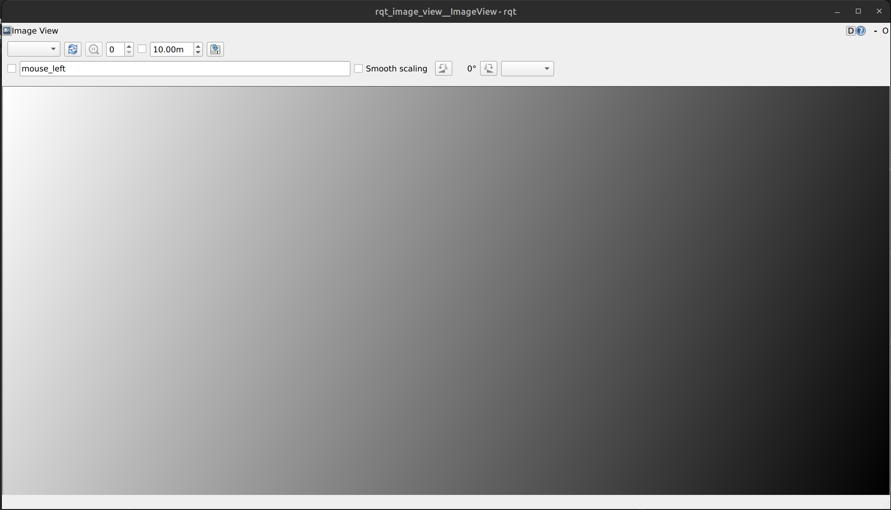
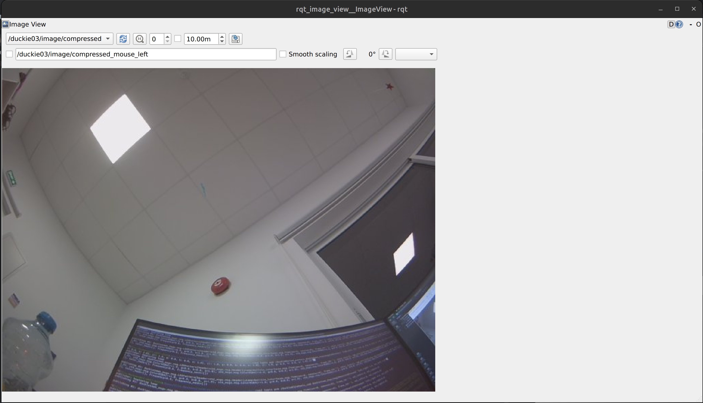

# Prerequisites

## Reading
This manual assumes that reader already familiar (at least on a basic level) with following technologies:
1. docker
2. linux terminal
3. ssh
4. git
5. ROS2 Humble (at least read [beginner tutorials](https://docs.ros.org/en/humble/Tutorials.html))

## Dependencies
Before continue reading this manual please install the following utils and clone the following repositories:

### Utils (linux)
1. [ROS2 Humble](https://docs.ros.org/en/humble/Installation.html) (better native installation)
2. git
3. CMake
4. Docker

### Utils (MacOS)
1. Docker (also setup it according to Liberalizm instruction (link will be provided later))
2. git

### Repositories
1. GUI Tools - https://github.com/robocy-lab/gui_tools
2. Duckietown ROS2 messages - https://github.com/robocy-lab/DuckietownRos2Messages

# How to connect to Duckiebot via SSH
+ You can connect to any Duckiebot via SSH.
+ To do so:
    ```shell
    ssh duckie@<duckiebot_name>.local
    ```
+ Duckiebot's name is written on its top cover.
+ Password is `quackquack`. 
+ The user duckie is in the sudo group.


# CLI/GUI interactions

## GUI control of Duckiebots
+ GUI Tools repository allows you to control Duckiebots using a virtual joystick. Follow the `ReadMe` of the repository

## CLI interactions
This section is valid if you have installed ROS2 on your machine. If you are running macOS, you can do all these things in ROS2 Humble Docker container.

### Initial setup
+ To be able to interact with Duckiebots via CLI, open the repository with Duckietown ROS2 messages
+ Build the messages and source the environment:
    ```shell
    colcon build
    # In a new terminal in the same folder
    source ./install/setup.bash
    ```
  
### List of topics
Duckiebots provide a lot of different topics which can be used to retrieve some data from the bot or to control it. For example for bot with name `duckie03` the list is following (for all other bots it is the same except all topic names are prefixed with the bot's name)
```
$ ros2 topic list
/duckie03/camera_info
/duckie03/emergency_stop
/duckie03/event
/duckie03/fragments
/duckie03/image/compressed
/duckie03/imu_data
/duckie03/joint_states
/duckie03/joy
/duckie03/joy/set_feedback
/duckie03/led_pattern
/duckie03/range
/duckie03/robot_description
/duckie03/temperature
/duckie03/tick
/duckie03/virtual_joystick
/duckie03/wheels_cmd
/duckie03/wheels_cmd_executed
```
Topics with sensor data:
+ `/duckie03/range` - data from ToF
+ `/duckie03/image/compressed` - images from camera
+ `/duckie03/tick` - motors encoder data
+ `/duckie03/wheels_cmd_executed` - list of all commands sent to motors
+ `/duckie03/temperature` - CPU temperature
+ `/duckie03/imu_data` - IMU data (currently unavailable)
+ `/duckie03/camera_info` - camera calibration parameters (currently unavailable) - to get camera calibration parameters use `intrinsic_calibration_tool` from `GUI tools` repository
  
Topics with LED/actuators controls:
+ `/duckie03/led_pattern` - controls the LED of Duckiebot
+ `/duckie03/wheels_cmd` - controls wheels of Duckiebot
+ `/duckie03/emergency_stop` - turns on/off emergency stop state (in this state Duckiebot won't react on control commands to motors)
  
Examples of controlling Duckiebot with ROS2 CLI:
+ Set all LEDs to red:
    ```shell
    ros2 topic pub /duckie03/led_pattern duckietown_msgs/msg/LEDPattern "{rgb_vals: [{r: 1.0, g: 0.0, b: 0.0, a: 1.0}, {r: 1.0, g: 0.0, b: 0.0, a: 1.0}, {r: 1.0, g: 0.0, b: 0.0, a: 1.0}, {r: 1.0, g: 0.0, b: 0.0, a: 1.0}, {r: 1.0, g: 0.0, b: 0.0, a: 1.0},]}"
    ```
	+ Here the values of LEDs are mapped in the following way:
      1. Left front
      2. Right rear
      3. Right front
      4. Unused
      5. Left rear 
+ Move Duckiebot forward:
    ```shell
    ros2 topic pub /duckie03/wheels_cmd duckietown_msgs/msg/WheelsCmdStamped "{vel_right: 1.0, vel_left: 1.0}"
    ```
    + Here `vel_right` is value for right wheel, `vel_left` is value for left wheel. Positive values mean forward movement, negative - backward. Values are in range from -1.0 to 1.0. 0.0 to stop.

To see with Duckiebot's camera, use:
1. Open `rqt_image_view`
    ```shell
    ros2 run rqt_image_view rqt_image_view
    ```
2. Update camera topic in `rqt_image_view` 
3. Choose `compressed` topic 
4. Enjoy!

# How to interact with Duckiebots via code
+ To interact with Duckiebots via code, you need to implement your own [ROS2 nodes](https://docs.ros.org/en/humble/Tutorials/Beginner-Client-Libraries/Writing-A-Simple-Py-Publisher-And-Subscriber.html)
+ The only difference is that you have to use custom messages from `Duckietown ROS2 messages` repository instead of standard ROS2 messages.
+ To do so, put the messages package into your ROS2 workspace.
+ In the code you can use the messages as usual python package:
    ```python
    from duckietown_msgs.msg import LEDPattern
    msg = LEDPattern()
    ```

# Troubleshooting
1. There is no native ROS2 installation on Duckiebots. The robots are running ROS2 Humble in Docker. So to write a program for Duckiebot, you need to:
   + Run it on your own machine (native or in Docker with `--network=host` flag)
   + Or use ROS2 Humble Docker container on Duckiebot. In this scenario you need to use the following flags for the container:
       + `--network=host` - to be able to debug topics from your machine
       + `--privileged` - to be able to access GPU and IPC
       + `-v /dev/shm:/dev/shm` - to make container able to shre memory with other ROS2 containers
2. If you are building container on your machine, which is intended to be run on Duckiebot, remember to build it for `ARM64` (which is architecture of Duckiebots)